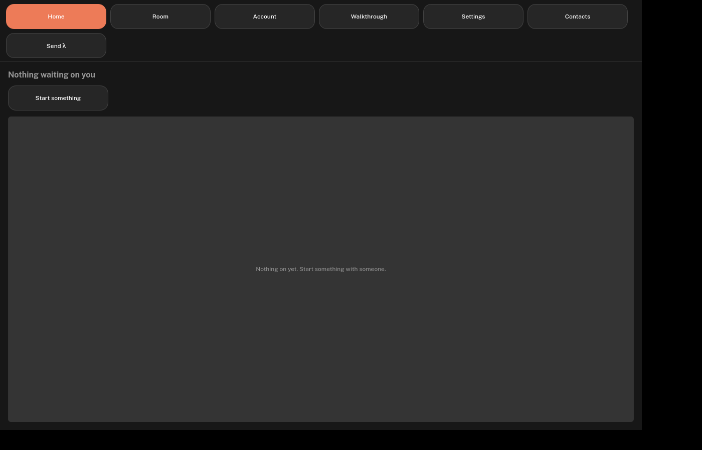
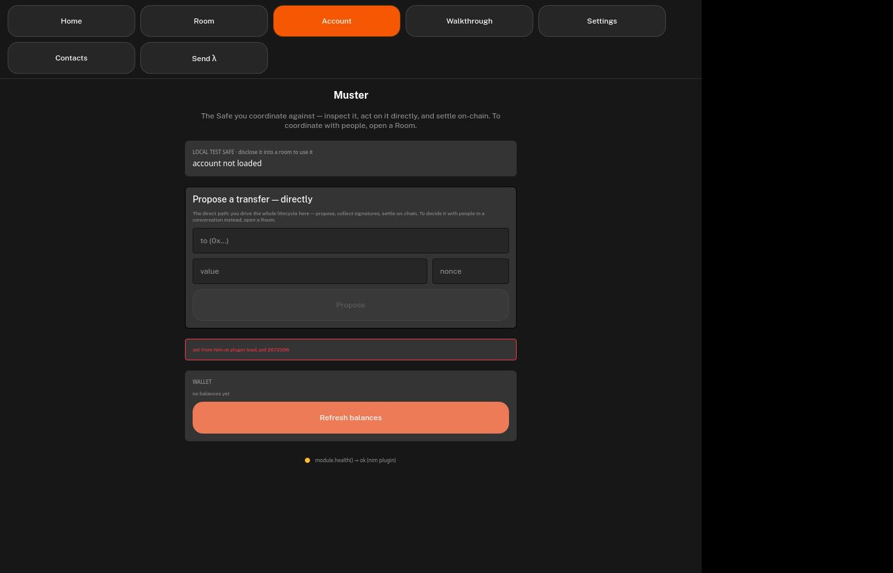

# Muster's UI on nim-seaqt: no C++ in the repo

**Status:** T0–T4 landed 2026-09-29 (§9). Both hosting probes have answered, and the gate awaits Jacek (§8). The hosting gate awaits Jacek (§8). Code: branch `feat/seaqt-ui`, [corpetty/muster#181](https://github.com/corpetty/muster/pull/181). Epic `exo-607` (pebbles; `pb dep tree exo-607` for live status).
**Reads with:** `docs/02-implementation-plan.md` (ADR-008 builder, ADR-013 the coherent UI builder, ADR-014 Nimbus/Status Nim reuse), `CLAUDE.md` working agreements (the UI reaches the module only through the logos API), `ui/tests/README.md`.
**Reference projects:** [`seaqt/nim-seaqt`](https://github.com/seaqt/nim-seaqt) (Qt bindings), `seaqt/nimside` (the `qobject:` DSL and plugin macros), [`arnetheduck/nora-poc`](https://github.com/arnetheduck/nora-poc) (the pilot where nimside's DSL was designed), `status-im/status-desktop` (the production consumer).

## At a glance

Muster's UI backend is 1,151 lines of C++ in a Qt plugin. It is a thin pass-through: 67 slots and 50 JSON-string properties, feeding QML from `muster_module`. Moving it to Nim on nim-seaqt is mechanical. The real work is at two boundaries:

- **Qt version.** Logos ships Qt 6.9.2, so the seaqt branch that loads in a Logos process is `qt-6.8`, not `qt-6.11` (§5).
- **The Basecamp plugin boundary** is C++ by construction. It can be generated at build time, but it cannot be written in Nim (§3, §5).

| Slice | Status | Result |
|---|---|---|
| T0: parity harness | done | Every offscreen self-test takes `MUSTER_UI=cpp\|nim`. C++ 8/8 green; Nim 8/8 red until T6. |
| T1: toolchain | done | seaqt `qt-6.8` + nimside, built by nix against the runner's own Qt 6.9.2 (same store paths). A nimside object binds to QML both ways. |
| T2: the contract in the DSL | done | `repContract` generates a nimside `qobject:` from the `.rep` repc reads. QtRO's view of it matches repc's, index for index: 50 properties, 50 signals, 67 slots. |
| T3: seaqt RemoteObjects | done | QtRemoteObjects bindings, generated at build time by the pinned seaqt-gen plus four patches, so no C++ is committed. A nimside source is remoted and driven through a dynamic replica both ways. |
| T4a: probe B, a standalone seaqt app | done | The real `Main.qml` runs in a Nim host, which starts logos-core itself and calls `muster_module` over `lp_*`. `health()` reaches the view as `ok`. No C++ of ours, no chronos worker. |
| T4b: probe A, a Nim plugin in Basecamp | done | A Nim `.so` works in the real `ui-host`, both ways through the builder's typed replica. That only happens once the object is registered under the replica's name, which today takes an ABI hack. It cannot reach the capability token without the C++ SDK. Two small `ui-host` changes would make A clean. |
| Gate | ready, needs Jacek | Both probes have answered. The five questions in §8. |

**For Jacek:**

- **The questions that decide the hosting path** are in [§8](#8-open-questions-for-jacek-and-the-operator).
- **What muster asked of nimside that it could not say directly** is the gap list at the end of [§9, T2](#t2-the-view-contract-in-the-dsl-exo-6073-2026-09-29).
  T3 and T4b add to that list.
- **What would make the Basecamp path (A) clean** is two small `ui-host` changes, in [§9, T4b](#t4b-probe-a-a-nim-plugin-inside-basecamps-host-exo-6076-2026-09-29).

## 1. What was asked

Jacek (arnetheduck), 2026-09-23: switch muster's UI to nim-seaqt, because that is what Status Desktop now uses and because it lets the backend and frontend share code. Asked what success looks like, he said: **"it works", with no C++ code in the repo.** He also wants muster as a **"sufficiently complex" playground to design a DSL for seaqt**. nora-poc was the earlier, much smaller pilot for that DSL.

So there are two deliverables. The first is a working muster UI whose native code is all Nim. The second is feedback on the DSL from an app big enough to stress it.

## 2. What is C++ today

| Where | Lines | What it is | Fate |
|---|---|---|---|
| `ui/src/muster_ui_backend.{cpp,h}` | 1,151 + 109 | The UI backend. It implements 67 slots and feeds 50 properties (all `QString`, all JSON) from 68 `muster_module` methods, plus the `MUSTER_AUTO*` autopilot the offscreen self-tests drive. | Port to Nim: the main job. |
| `ui/src/muster_ui.rep` | 420 | The view contract. repc turns it into C++, and it is not C++ itself. | Becomes the DSL declaration, or stays as the generated contract (§5). |
| `module/tools/headless-host/muster_headless_host.cpp` | 148 | A headless logos-core host that drives muster over raw QtRO dynamic replicas. | Port to Nim (needs QtRO bindings, §4). |
| `module/tests/probes/host_return_harness.cpp` | 232 | A probe harness that reimplements the C++ host's return marshalling. | Port to Nim. It is already a reimplementation. |
| `demo/muster-ui/` | ~5,500 | The speed build, a fork of logos-chat-ui. It is deliberately not the specified client. | Decide: delete, or move out of the repo (§8, Q4). |

Unaffected: the QML (~8,900 lines in `ui/src/qml/`), the Nim core (`module/`), and the design system (`Logos.Theme` / `Logos.Controls` are pure QML, so any Qt host can import them).

The backend is a thin conduit. Each slot calls `muster_module` synchronously and writes the JSON string it returns into a property, which QtRO syncs to the QML replica. It keeps no state beyond two retry counters. That makes the port mechanical: the hard parts are the boundaries, not the logic.

## 3. How a UI module is hosted today

This comes from reading logos-module-builder, logos-plugin-qt, logos-qt-sdk, logos-view-module-runtime and logos-standalone-app at the revisions `ui/flake.lock` pins. Three processes are involved:

- **The app process** (Basecamp or `logos-standalone-app`) runs the QML in a QQuickWidget. It loads `muster_ui_replica_factory.so`, which builds the **typed** repc replica that `logos.module("muster_ui")` returns (`Main.qml:38`).
- **A `ui-host` child** loads `muster_ui_plugin.so` with QPluginLoader. It calls `initLogos(LogosAPI*)`, casts the plugin with `qobject_cast<LogosViewPlugin*>`, and calls `enableRemoting<MusterUiSourceAPI>(backend)`. The backend is our `MusterUiBackend : MusterUiSimpleSource, LogosUiPluginContext`.
- **`logos_host_qt` children** host the core modules (muster_module, delivery_module, lez_core).

We write only the backend class and the `.rep`. The builder generates everything else in C++ at build time: the plugin glue (`Q_PLUGIN_METADATA`, the `PluginInterface` / `LogosViewPlugin` interfaces), the repc source and replica, the replica factory, and the Qt-typed `muster_module` client behind `modules()`. The builder has a Nim path (`codegen.nim`) only for **core** modules, which is how `module/` ships with no C++. **There is no Nim path for `ui_qml` modules.**

## 4. What seaqt gives, and what it does not

**What it gives:**

- **Bindings:** nim-seaqt binds QtCore, Gui, Widgets, Qml and Quick, among others. Every binding compiles a generated C++ wrapper through `{.compile.}` at Nim build time. So a seaqt project already has C++ generated at build time, and none of it is committed. "No C++ in the repo" is naturally read the same way.
- **The DSL:** the `qobject:` macro now lives in **nimside** (extracted from nora-poc). It builds a moc-format QMetaObject at compile time, with `qproperty`, `slot` and `signal` pragmas, generated getters and setters, `xChanged` signals and `metacall` dispatch. This is the DSL Jacek is designing.
- **Types:** nimside's supported types are scalars, `string`, `seq[string]` and QObject. Muster's contract is 49 string properties and 65 string slots, so **it fits the DSL today**.
- **Plugins:** nimside's `plugingen` makes a Nim `.so` loadable by QPluginLoader.
- **List models:** `VirtualQAbstractListModel` overrides work. nora-poc has a table model.

**What it does not give:**

- **QtRemoteObjects is not bound.** The generator is driven by a module list, so adding `"RemoteObjects"` is one line in a seaqt-gen fork. Only the non-template API comes out: `acquireDynamic`, `enableRemoting(QObject*)`, not `acquire<T>` / `enableRemoting<Api>`.
- **No C++ interfaces from Nim.** A Nim object cannot answer `qobject_cast<PluginInterface*>` or `qobject_cast<LogosViewPlugin*>`, because that needs a real C++ vtable subobject. The seaqt author said so in nim-seaqt#2: interop "can only be achieved by generating C++ code on the fly (doable, but not present in seaqt right now)". nimside's `plugingen` already emits C++ into nimcache for the plugin metadata, so emitting the interface shim there is the natural extension.
- **No `qmlRegisterType`:** Status uses context properties only. We already use a replica or context object, so this does not matter to us.
- **Plugin metadata limits:** nimside's CBOR encoder writes no `MetaData` key and caps strings at 255 bytes. The builder's plugin metadata is our `metadata.json`.

**Maturity:** preview-grade, but Status runs it in production. Branches are rebased with no releases, so we pin by commit. There are sharp edges in ownership (the `owner` flag), in Nim exceptions escaping into C++, and in cross-thread signals, which use raw `ptr`s.

## 5. Two constraints that shape the plan

**Qt version.** Everything Logos ships links **Qt 6.9.2**: Basecamp, the standalone runner, `ui-host` and all 285 local `muster_ui` builds. seaqt bindings work on the same Qt minor version or newer, and they compile against Qt's *private* headers, so they are tied to the exact Qt build. So:

- **`qt-6.11` cannot load in a Logos process today.** One process cannot hold two Qt copies.
- **`qt-6.8` is the branch that fits Qt 6.9.2.** It is also what Status Desktop's master vendors today: `vendor/nim-seaqt` is at `7d40abd7`, the `qt-6.8` head, running on Qt 6.11 through a small compat shim.
- **Moving to `qt-6.11` is a one-line pin bump** once Logos moves to Qt 6.11, or for a process that loads no Logos Qt libraries.

**The Basecamp plugin boundary is C++ by construction.** QPluginLoader needs plugin entry points. The host casts to C++ interfaces. The typed replica expects the repc source layout, because QtRO binds properties and slots **by index**. All of that can be *generated at build time*, but it cannot be written in Nim. So "no C++ in the repo" inside Basecamp means a generator must emit that shim, either nimside or the builder.

## 6. Options

| | **A: a Nim plugin inside Basecamp** | **B: a standalone seaqt app** | **C: QML-only** (baseline) |
|---|---|---|---|
| Shape | `muster_ui_plugin.so` is built by `nim c --app:lib` and loaded by `ui-host`. The backend is a nimside `qobject:`, remoted over QtRO to the builder's typed replica. | `muster-app` is a Nim executable (the Status Desktop shape). It owns a QGuiApplication and a QQmlApplicationEngine, loads the existing QML, and exposes the backend as a context property. | No backend `.so`. QML calls `logos.callModuleAsync("muster_module", …)` directly, and the host supports this today. |
| Hosted by Basecamp | Yes | No. Muster would run as its own app, plus `logoscore` headless. | Yes |
| C++ in the repo | None. The shim is generated at build time by an extended nimside `plugingen` or by the builder. | None | None |
| seaqt / DSL playground | Yes: the backend, QtRO and plugin emission | Yes, the fullest: an app, models and threading | No: it uses no seaqt |
| Upstream work | seaqt-gen (RemoteObjects), nimside (an interface shim, a QtRO signature or matching index order, a `MetaData` key), logos-module-builder (a Nim `ui_qml` path) | seaqt-gen (RemoteObjects, needed if module calls go over QtRO), none in Logos | None |
| Hardest part | The typed replica binds by index. A Nim source must reproduce repc's property and slot order exactly, or values land in the wrong properties silently. | Calling hosted core modules from a Nim host process (unproven; the C++ headless host had to bypass `LogosAPIClient`). Module calls must also go **async**, because the backend moves onto the render thread, where today's sync calls would freeze the UI. | The `MUSTER_AUTO*` autopilot (QML cannot read the environment) and the audit file write would have to move into the module. |
| Risk | High | Medium | Low |
| Size | L | M | M |

**Update (T4b, 2026-09-29):** option A works, but not cleanly. A Nim plugin can replace the C++ one inside `ui-host`, with two catches:

- **The replica's name.** `ui-host`'s dynamic fallback registers the object under the module's name, while the typed replica asks for the `.rep` class name. So the plugin has to impersonate the C++ `LogosViewPlugin` interface to be registered correctly.
- **The token.** The capability token reaches a plugin only as a C++ `LogosAPI*`.

Two small `ui-host` changes would remove both (§9, T4b).

**Update (T4a, 2026-09-29):** option B's hardest part is resolved. A Nim host calls hosted modules over the `lp_*` ABI the modules embed, and a result arrives on the Qt main thread, where the client lives. So the UI stays responsive without a worker thread (§9, T4a).

**Code sharing**, Jacek's second point, comes the same way in A and B. The UI's `muster_module` client becomes the **logos-nim-sdk consumer client generated from `muster.lidl`**, the same generator and contract the module is built from. Its typed Nim calls replace the C++ `LogosModules` client and the stringly-typed glue, and the UI can decode results into the module's own record types. Linking the Nim core into the UI process would **not** be code sharing. It would break the working agreement that the UI reaches the module only through the logos API, and the plan does not do it.

**Recommendation, after the probes (2026-09-29):**

- **Choose B** unless Basecamp hosting is required now. It works end to end with no hacks: the real QML, logos-core, and `lp_*` calls on the GUI thread.
- **Choose A** once `ui-host` gains the two changes in §9, T4b: a C-ABI token handoff, and a plugin naming its remote object. Before that, A needs either a C++ shim generated at build time or an ABI-level impersonation.

The original recommendation follows.

**Recommendation (at scoping):** start with the slices both A and B need (T1–T3 below). They are cheap, and they give Jacek the DSL exercise within days. Take the hosting question (Q2) to Jacek with this evidence. Lean **B** if Basecamp hosting can wait: it is the shape his tools (nimside, nora-poc) and Status already use, and it needs nothing from the Logos builder or Basecamp's C++ plugin ABI, which may itself change if Logos moves to seaqt. Choose **A** if Basecamp hosting is non-negotiable, and spike it before committing. C meets "no C++" most cheaply, but it produces no playground, so it is the fallback, not the goal.

## 7. The plan

The slices are tracked under epic `exo-607`. T1–T3 are needed whatever the hosting decision, and T0 (the parity harness) comes first by working agreement.

| Slice | What | Size | Depends on | Status |
|---|---|---|---|---|
| **T0** (exo-607.1) | **Parity harness first.** The offscreen self-tests (`card-`, `audit-download-`, `invite-`, `split-self-test.sh`, `two-instance-proof.sh`) and `ui/tests/muster-ui-test.mjs` gain a switch that selects the UI build. Recorded green on C++ and red on Nim. That is the acceptance oracle for every later slice, and the `MUSTER_AUTO*` autopilot is part of the contract. | S | — | done |
| **T1** (exo-607.2) | **Toolchain.** A nix derivation in the repo flake builds seaqt (`qt-6.8`, pinned by commit) and nimside against **the same Qt 6.9.2 store path the runner uses** (pkg-config + private headers). A hello window loads one QML file and binds one nimside `qobject:` property. | S | — | done |
| **T2** (exo-607.3) | **The contract in the DSL.** Declare the view contract (50 properties, 67 slots) as a nimside `qobject:`, with one source of truth: the Nim declaration generates the `.rep`, or the reverse. Check the metaobject order against repc's. Output: the first list of nimside gaps. | S–M | T1 | done |
| **T3** (exo-607.4) | **seaqt RemoteObjects.** Add `RemoteObjects` to a seaqt-gen fork and generate the bindings (`QRemoteObjectNode`, `acquireDynamic`, `enableRemoting(QObject*)`). Needed by A, by B's likely module-call path, and by the headless-host port. Offer it upstream. | M | T1 | done |
| **T4a** (exo-607.5) | **Probe B.** `muster-app` loads `Main.qml` with a Nim `logos` shim (`module()`, `isViewModuleReady()`), stands up logos-core, and makes an **async** `muster_module` call from Nim. It follows nora-poc's chronos worker + ThreadChannel pattern for results. | M | T2, T3 | done |
| **T4b** (exo-607.6) | **Probe A.** `ui-host` loads a Nim `.so`. nimside `plugingen` is extended to emit the `PluginInterface` / `LogosViewPlugin` shim, the T2 object is remoted, and the builder's typed replica reads a property and invokes a slot correctly. The capability token is forwarded from `initLogos` to `lp_*`. | L | T2, T3 | done |
| **Gate** (exo-607.7) | Choose A or B with Jacek (Q1–Q5). Record it as an ADR in `02-implementation-plan.md`. Skip whichever probe the answer makes moot. | — | T4a or T4b | ready: needs Jacek |
| **T5** (exo-607.8) | **Port the backend logic.** All 67 slots, the autopilot, the retry timers and the audit download, calling `muster_module` through the logos-nim-sdk consumer client generated from `muster.lidl`. | M | Gate, T0 | — |
| **T6** (exo-607.9) | **Hosting integration.** For A: a Nim `ui_qml` path in logos-module-builder (an upstream PR, like #202/#226) and the `ui/` flake. For B: a `muster-app` flake app, with `make run` / `run-fleet` and the AppImage switched over. T0 goes green on the Nim build. | M (B) / L (A) | T5 | — |
| **T7** (exo-607.10) | **Delete the C++.** Remove `ui/src/*.{cpp,h}` (and the `.rep` + CMakeLists under B), port the headless host and the probe harness to Nim, act on the `demo/muster-ui` decision, and add a `scripts/check-no-cpp.py` gate so C++ cannot come back unnoticed. | S–M | T6 | — |
| **T8** (exo-607.11) | **The DSL payoff.** Write up for Jacek what muster needed from nimside and seaqt. Optionally make the playground genuinely complex: replace the JSON-string properties for intents, messages and members with typed list models, with nested objects, signals with arguments and cross-thread updates. | open | T5 | — |

## 8. Open questions (for Jacek and the operator)

1. **Qt 6.11 or Qt 6.9.2?** Logos runs 6.9.2, so only `qt-6.8` loads in its processes, and Status's own master vendors the `qt-6.8` head. Is `qt-6.11` a hard ask, or "whatever Status uses"? It only becomes possible when Logos moves, or under option B if the app process loads no Logos Qt libraries.
2. **Inside Basecamp, or a standalone app?** The probes now inform this question. B works as-is. A needs either two small `ui-host` changes upstream, or build-time C++ glue (§9, T4b). Would Logos take those `ui-host` changes? Does "it works" require the UI to stay a Basecamp `ui_qml` module (A), or is a standalone seaqt app acceptable (B)? If B, and "no C++" holds, the Basecamp-hosted UI goes away until a Nim `ui_qml` path exists.
3. **Is C++ generated at build time acceptable?** seaqt's own wrappers are exactly that, so presumably yes. The plugin shim in A depends on it.
4. **`demo/muster-ui` (~5,500 lines of C++):** delete, move to its own repo, or exempt as "not the client"?
5. **What is the DSL:** nimside's `qobject:` layer (as in nora-poc), or something higher, such as declaring views as well? Should muster's contract move from JSON strings to typed models, to make the playground "sufficiently complex" (T8)?

## 9. Progress

### T0: the parity harness (exo-607.1, 2026-09-29)

- **`scripts/lib/ui-build.sh`** is sourced by every offscreen self-test. `MUSTER_UI=cpp` (the default) drives `.run/runner`. `MUSTER_UI=nim` drives `.run/runner-nim`, which nothing builds until T6, so every test is red on it with the reason stated.
- **The header of `ui-build.sh` is the contract** a UI build must meet:
  - an executable that takes `--user-dir`;
  - it hosts `muster_module`, whose `MUSTER-LP` lines reach its log;
  - it runs the `MUSTER_AUTO*` autopilot;
  - QML errors reach the same log.

  The Nim build inherits this contract unchanged, which is what makes the self-tests its oracle.
- **Cleanup is per session.** Each instance runs under `setsid`, and cleanup kills only those sessions. Before, a machine-wide `pkill -f logos_host_qt` killed every session's runners.
- **`scripts/ui-parity.sh`** runs the whole suite, one test at a time, and prints a green/red table.
- **`muster-ui-test.mjs`** already takes the app binary as an argument (`ui/tests/README.md`, "Which UI build it tests").

The baseline, run at `5718d59` against the live fleet:

| Test | `MUSTER_UI=cpp` | `MUSTER_UI=nim` |
|---|---|---|
| card | green, 15 s | red: no build |
| infra (Safe) | green, 15 s | red: no build |
| infra (threshold) | green, 15 s | red: no build |
| audit | green, 21 s | red: no build |
| invite | green, 13 s | red: no build |
| two-instance | green, 16 s | red: no build |
| split | green, 21 s | red: no build |
| split-btc (joined after the rebase) | green, 35 s | red: no build |

After the branch was rebased onto `main` (`cc30b95`), the suite was re-run at `7ff9ad1` on a rebuilt runner. It was 8/8 green, now including `main`'s new `split-btc-self-test.sh`, converted to the build switch. `split-btc` runs under `nix shell nixpkgs#bitcoind`.

No process from either run outlived it. An unrelated, days-old offscreen runner on the same machine survived, where the old machine-wide `pkill` would have killed it.

The audit self-test also checks that its button is wired, by grepping `muster_ui.rep` for the `downloadAudit` slot. That check is C++-shaped, and T5 re-targets it to the Nim declaration.

### T1: the toolchain (exo-607.2, 2026-09-29)

- **What it is:** `ui-nim/flake.nix` pins nim-seaqt `qt-6.8` (`7d40abd7`) and nimside (`3840606`), and takes nixpkgs from the logos-module-builder rev that `ui/flake.nix` pins.
- **The Qt is the runner's own.** `seaqt-hello` links `/nix/store/dkfr32yi…-qtbase-6.9.2` and `agvpq5n8…-qtdeclarative-6.9.2`. These are the exact store paths in the C++ runner's closure.
- **The gate:** `hello/` is one nimside `qobject:` and one QML file. `--self-test` passes 3/3 offscreen, and runs as `checks.<system>.hello`:
  - QML calls a slot with an argument;
  - QML writes a property through the generated setter;
  - a Nim `setGreeting` reaches a QML binding.
- **Found on the way:**
  - The `qt-6.8` bindings compile on 6.9.2 without the `-fpermissive` that nora-poc needed.
  - Nim's C-driver link must name `libstdc++`, because seaqt's wrappers are C++.
  - Nim 2.2.4 (the pinned nixpkgs) is enough for nimside, whose nimble file asks for 2.2.8 or newer.

### T2: the view contract in the DSL (exo-607.3, 2026-09-29)

**One source of truth, and it stays the `.rep`.** `ui-nim/contract/repcontract.nim` is a repc for nimside: the macro `repContract(MusterUi, "ui/src/muster_ui.rep")` parses the `.rep` at compile time and generates a nimside `qobject:`. It has 50 properties, 66 slots, a Nim setter per property, `setContractProp` and `create`. Why the `.rep` stays the source:

- **It already exists,** with its comments.
- **The C++ build's repc reads it.**
- **Option A's typed replica is generated from it.**

So the two backends cannot drift during the port, and the order QtRO binds by is the file's order in both. Under option B, once the C++ is gone, the `.rep` can stay as the contract's text or be replaced by a hand-written `qobject:`. The macro is the bridge either way.

**How the contract maps onto nimside:**

- **A SLOT** becomes a nimside slot that calls `<slot>Impl(o, args…)`. Those are forward declarations the backend module must implement. Leave one out and the compile fails naming it (`implementation of 'twoImpl(o: Tiny, v: string)' expected`), the Nim counterpart of a C++ pure virtual. The slot catches any exception from its Impl and reports it, so nothing unwinds into Qt's C++ frames.
- **A PROP** becomes a `qproperty(write = false)` that QML reads but cannot write (repc's READONLY), plus a generated Nim `setX` that emits `xChanged` only on change. The defaults come from the `.rep`.

**The check** (`checks.contract`, 13 PASS, 0 FAIL):

1. **QtRO's API view.** It compares the API QtRO's `DynamicApiMap` derives from the Nim object's metaobject against the API repc writes for the typed source, which the check runs repc to produce. The 50 properties, 50 notify signals and 66 methods agree name for name, in order, with identical method signatures.
2. **QML to Nim.** All 66 slots (67 since the BTC split landed), called from QML with distinct arguments, reach their Impl with those arguments, in order.
3. **Nim to QML.** All 50 properties read their `.rep` defaults from QML and then their new values after the Nim setters. A write from QML is refused: `Cannot assign to read-only property`.
4. **The real QML.** All 109 `backend.<name>` references in `ui/src/qml` name something in the contract.

**It keeps up with the contract on its own.** After this branch was rebased onto a `main` whose `.rep` had gained a SLOT (the BTC split's), the check passed unchanged: 50 properties, **67** SLOTs and 110 QML references, index for index, with no edit to the Nim side. That is the single source of truth doing its job.

**The nimside gap list for Jacek, first cut.** What the DSL could not say directly, and how the macro works around it:

1. **No "read-only to QML, settable from Nim" property.** repc's READONLY is exactly that, and it is the norm for a view contract, because the backend is the only writer. nimside has `write = true`, which makes the property QML-writable, and `write = false`, which gives it no setter at all. The macro pairs `write = false` with a generated Nim setter that emits the notify signal.
2. **Notify signals carry no value.** nimside's is `healthChanged()`; repc's and moc's convention is `healthChanged(QString)`. This is harmless for QtRO, which sends a notify as a property change by index, but a Nim or C++ listener cannot take the new value from the signal.
3. **Accessors become slots.** nimside registers each property's getter (and setter, when writable) as a *slot* in the metaobject; moc and repc do not. A QtRO dynamic source therefore remotes 50 extra methods, and a typed replica is safe only because they happen to sort after the declared slots. nimside does not promise that order.
4. **No contract/implementation split.** The declaration and its implementation must share a module, because forward declarations do. The macro emulates C++'s pure virtuals that way. A DSL-level "contract" or "interface" block, implemented elsewhere, would say it directly.
5. **Slots must be `raises: []`.** Every implementation needs its own exception guard, or the DSL could generate one. The macro generates it.
6. **No classinfo.** QtRO's "RemoteObject Signature" cannot be declared, so QtRO skips its signature check between source and replica. Nothing verifies they are the same contract except the index agreement this check tests.
7. **An undocumented pass-through.** Non-slot procs in a `qobject:` body pass through in order. The forward declarations rely on this.
8. **The type set is enough today, but not beyond.** It covers muster's all-string contract. Typed models or records (T8) would hit its limits.

Also found: 7 contract entries are never named as `backend.<x>` in the QML: `checkHealth`, `declineJson`, `loadActivity`, `loadDrivers`, `loadFrostCeremonies`, `loadPolicy`, `startInbox`. The C++ backend or its autopilot calls some of them itself. The rest are candidates for removal from the contract.

### T3: seaqt RemoteObjects (exo-607.4, 2026-09-29)

**Generated at build time, so no C++ is committed.** `ui-nim/nix/seaqt-ro.nix` runs seaqt-gen in the nix sandbox and adds its RemoteObjects output to nim-seaqt `qt-6.8`. The generated wrappers are C++ (`gen_*.cpp/.h`), so they exist only in the build. The repo carries the four generator patches in `ui-nim/nix/seaqt-gen-patches/`, which are Go diffs.

- **The generator is seaqt-gen `56485e6`,** the revision that produced nim-seaqt `qt-6.8@7d40abd7`. A QtCore regenerated with it is structurally identical: its only diffs are 6.8.3 → 6.9.2 API changes.
- **Clang must be 14.0.6,** the version in the generator's Docker image. clang 16 and later print nested types unqualified, and the generator panics. The runner's nixpkgs no longer has clang 14, so it comes from a pinned nixos-24.05, as a build tool only.
- **Only Core, Network and RemoteObjects are parsed,** which is RemoteObjects' whole pkg-config closure.
- **The build is reproducible.** The sandbox build's output is byte-identical to the one the spike produced by hand.

**The patches:**

| Patch | What it does | Upstream? |
|---|---|---|
| 0001 | Adds `RemoteObjects` to the Qt 6 module list, plus `qtremoteobjects` in the Docker images. | yes |
| 0002 | `SEAQT_GEN_MODULES`, to parse only the closure. | local only |
| 0003 | A parameter named `self` (`QRemoteObjectPendingCallWatcher::finished`) collided in both the C ABI and the Nim output. | yes, required |
| 0004 | `QSet<T>` return values emitted invalid Nim (`QtROIoDeviceBase::remoteObjects()`). The same bug already ships unexercised in nim-seaqt's QtStateMachine and QtDesigner bindings. | yes, required |

**What is bound:** QRemoteObjectNode, Host, HostBase and RegistryHost; the Replica, DynamicReplica and Registry; QAbstractItemModelReplica; pending calls and their watcher; the persisted stores; and the transport and factory classes.

**What is not bound:**

- **Templates:** `acquire<T>`, `enableRemoting<Api>`, `QRemoteObjectPendingReply<T>`, `registerType<T>`.
- **Five blocked methods**, listed in the derivation's `ro-blocked.txt`.

**The proof** is `checks.ro`, 9 PASS. In one process, a nimside source is remoted over `local:`, acquired as a dynamic replica, and driven both ways:

- the initial value reaches the replica;
- a slot call on the replica reaches the Nim slot;
- a source change reaches the replica;
- a property write on the replica reaches the source.

It links the runner's `qtbase` and `qtremoteobjects` 6.9.2 exactly.

**For the gap list:**

- **Ownership.** `acquireDynamic` hands back its replica with `owned: false`, so Nim never deletes it. Parent it or delete it by hand.
- **No QString type.** seaqt has none, so a string argument to `invokeMethod` goes in as `QGenericArgument.create("QString", QVariant.constData())`.
- **A version split.** These bindings say GenVersion 6.9.2 while the rest of nim-seaqt says 6.8.3. That is harmless on Logos's Qt, and it goes away once seaqt regenerates with 0001.
- **The accessor-slot finding from T2, seen from the replica side.** nimside's getters and setters arrive on a dynamic replica as remote methods, and a non-void one returns a pending call.

**Not covered:** cross-process use, a typed (repc) replica against a Nim source (T4b's question), model replicas, the registry, and aarch64.

### T4a: probe B, a standalone seaqt app (exo-607.5, 2026-09-29)

**It works.** `ui-nim#muster-app` runs the real `ui/src/qml/Main.qml`, all fifteen files with `Logos.Theme` and `Logos.Controls`, in a Nim host. It uses no Basecamp, no `ui-host` and no QtRO.

- **The backend** is the T2 contract object.
- **The `logos` bridge** is a small nimside `qobject:`. Its `module("muster_ui")` returns the backend. It also has `isViewModuleReady` and the `viewModuleReadyChanged` signal. That is all muster's QML uses of the Logos bridge.



**The core half.** The host starts logos-core in its own process through liblogos's C API, the same five calls `logos-standalone-app` makes: add the modules dir, set the persistence path, start, and load `capability_module` and then `muster_module` with its dependencies. Each module runs in a `logos_host`. The host then does what the Logos host does for a view module:

1. It takes the core's `capability_module` token.
2. It registers a fresh view token with `capability_module` (`lp_inform_module_token`).
3. It calls `muster_module` as `muster_ui` over `lp_*`, the consumer ABI the modules embed and logos-nim-sdk binds.

`checkHealth` is implemented for real: `lp_invoke_async("health")` returns `ok` into the `health` property.

**The checks:**

- `checks.muster-app-view` runs in the nix sandbox. The view loads with no QML errors, `logos.module` returns the backend, and QML makes its load-time calls to it.
- `scripts/nim-app-core-probe.sh` runs against the modules `make build` produced (5 PASS). The core starts, the token handshake succeeds, and `muster_module.health()` sets the property to `ok`. `logos_core_cleanup` leaves no process behind.
- The screenshot above is the host on Xvfb, with the core running.

**Pinned so it cannot drift.** Every Logos piece comes through the same `logos-module-builder` rev as `ui/flake.nix`:

- `inputs.logos-standalone-app` supplies `liblogos_core`, `logos_host` and the bundled design system, the runner's own `44f5zpbl…` build.
- `inputs.logos-protocol`'s `logos-protocol-lib` 0.2.0 supplies the same 21 `lp_*` symbols `muster_module` embeds.
- The binary links one Qt, `dkfr32yi…-qtbase-6.9.2`.

**What it settled:**

- **No chronos worker or ThreadChannel.** The plan assumed nora-poc's pattern was needed to bring results back to the GUI thread. On the QtRO transport an `lp_*` client is owned by the Qt main thread, and `lp_invoke_async`'s callback fires there. The callback sets the property directly, and the UI never blocks on a module call.
- **The newer liblogos cannot call a module.** It exports no call method: `logos_core_call_plugin_method_async` in the older `logos_core.h` is gone. Module calls go through `lp_*` from logos-protocol, and liblogos only starts the core, loads modules and hands out tokens.
- **The host plays two roles, in one token store.** It saves the core's capability token to register the view, then saves the view token under `core` and `capability_module` for its own calls. `ui-host` does the same split across two processes.

**Gaps found, for logos-nim-sdk** (corpetty/logos-nim-sdk):

1. `ffi.nim` binds no consumer-side token calls, `lp_inform_module_token` and `lp_token_get`. Its users so far are modules, which receive a token, whereas a host registers one. The probe declares them locally (`ui-nim/app/logos_core.nim`).
2. `ffi.nim`'s opaque handles are `importc: "struct LpClient"` with no file-scope declaration. Under gcc 14, each prototype then declares its own `struct LpClient`, and passing one handle to another prototype is a hard error. The probe emits `struct LpClient; struct LpSubscription;` in each module that names them. The SDK should emit it once.

**Both are fixed upstream:** [corpetty/logos-nim-sdk#6](https://github.com/corpetty/logos-nim-sdk/pull/6), merged as `6077eb7`. muster's pin moved there in exo-607.12, in both `module/metadata.json` and `ui-nim/flake.nix`, and the two local workarounds are gone.

**Not yet:** the view has only `checkHealth` implemented, and the other 65 slots are T5. The host does not yet take `--user-dir` or run the `MUSTER_AUTO*` autopilot, which is T0's contract for a Nim build (T6).

### T4b: probe A, a Nim plugin inside Basecamp's host (exo-607.6, 2026-09-29)

**It loads, and it works both ways once named correctly.** A Nim `--app:lib` library, whose Qt plugin instance *is* the T2 contract object, replaced `muster_ui_plugin.so` in a copy of the runner's plugin directory. The builder-generated replica factory was left unchanged.

- **Loading.** The real `ui-host` loads it and prints READY. `NimMain` runs at `dlopen`. The library links one Qt.
- **Plain dynamic fallback: the typed replica stalls.** This is ui-host's path when a plugin is not a `LogosViewPlugin`.
  - The cause is the name. The builder's replica factory acquires the `.rep` class name, `MusterUi`, but the fallback registers the object under the module name, `muster_ui`. They never meet.
  - The signature is not the problem. A nimside source's signature is empty, and QtRO's check passes whenever one side is empty.
  - QML calls on a replica that never initialized are dropped silently.
- **Registered as `MusterUi`: Valid.**
  - The typed replica initializes against the Nim dynamic source and binds all 50 properties. This confirms T2's index agreement in the real host.
  - QML → Nim: slot calls arrive with their arguments, including `propose({…})`, `setSetting(rpc, …)` and the 2-second `loadInvites()` timer.
  - Nim → QML: properties set from Nim at plugin load show on screen.
  - **How the name was fixed:** the Nim object answered `qt_metacast("logos.view.plugin/1.0")` with a Nim struct laid out like the C++ `LogosViewPlugin`, an Itanium vtable. So `ui-host` called the Nim `enableRemoting`, which registers the object as `MusterUi`. That is an ABI impersonation: fine for a probe, never for the product.



**The token is the real blocker.** `ui-host` gives a plugin its capability token only through `initLogos(LogosAPI*)`, a C++ object.

- **Receiving the pointer works, with a patch.** A six-line nimside patch lets a slot parameter name its own Qt type:

  ```nim
  ParamDef(name: `name`, metaType:
    when compiles(qtTypeName(`typ`)): qtTypeName(`typ`)   # e.g. "LogosAPI*"
    else: $QBuiltinMetaType.resolve(`typ`))
  ```

  With it, a Nim `initLogos(LogosAPI*)` is invoked, and Nim receives the object: `className=LogosAPI`, parented to the application.
- **Reading the token from it does not.**
  - `getTokenManager()` and `getToken()` are non-virtual C++.
  - `LogosAPI` has no invokable methods and no properties.
  - `ui-host` links the SDK statically, so `dlsym` finds none of its symbols.
  - liblogos is not loaded in `ui-host` at all.

  Reaching the token takes the C++ SDK: either mangled calls into its archive or a generated accessor.

**What would make option A clean.** Two small upstream asks for `ui-host` (logos-view-module-runtime):

1. **A language-neutral token handoff for view plugins.** For example, `dlsym(plugin, "logos_view_accept_token")`, mirroring the `logos_module_accept_token` C-ABI handshake core modules already use. muster's Nim core module has used that handshake since the live-wire work.
2. **Let a plugin name its remote object.** A C export, or a "RemoteObject Type" classinfo, so the dynamic fallback registers it under the name the typed replica acquires. No interface impersonation would then be needed.

With both, a Nim UI plugin would call `muster_module` exactly as the T4a host does: through `lp_*`, linking logos-protocol the way `muster_module` does. The interim path for A is the nimside patch plus a generated accessor, which is C++ at build time.

**The plugin metadata.**

- **What `ui-host` needs:** a valid Qt plugin (metadata v2) and `qt_plugin_instance`. It does not check the IID.
- **What the standalone app needs:** it reads the directory's `metadata.json` and takes the first `*.so` by name.
- **Basecamp** uses the manifest's `main` and was not tested.
- **The C++ plugin's metadata** also embeds `metadata.json` and `logos_protocol_version` under `MetaData`. nimside's `Q_PLUGIN_METADATA` cannot emit that key.

**For the gap list (nimside):**

- `Q_PLUGIN_METADATA` builds its instance as a hidden `T()`. The plugin cannot construct it itself, so `create()` and the `.rep` defaults never run, and Nim cannot reach the instance to set a property. It also cannot emit `MetaData`, and its strings are capped at 255 bytes, while `metadata.json` is about 1.2 KB.
- Slot parameter types are a closed list, so an opaque pointer is rejected. The patch above opens it.
- No classinfo, and no `Q_INTERFACES`. A `metacast` override works as a stopgap.

**Also found:**

- **Offscreen instantiates the runner's QML.** An offscreen run of the runner received the QML timer's `loadInvites()`, which contradicts the labbook's note that offscreen never instantiates the view.
- **Warnings predate this work.** The QML warnings seen in these runs (Walkthrough.qml and others) appear in the C++ control too.
- **Debug logging exposes tokens.** `qt.remoteobjects.debug` logs capability tokens in clear. Leave it off outside a probe.

**Not verified:**

- Basecamp's own `ui-host` build.
- Reading the token in Nim.
- Whether an `lp_*` client inside `ui-host` could obtain a `muster_module` token.
- Shutdown with the impersonated interface: `ui-host` deletes the plugin object while Nim holds a ref.
